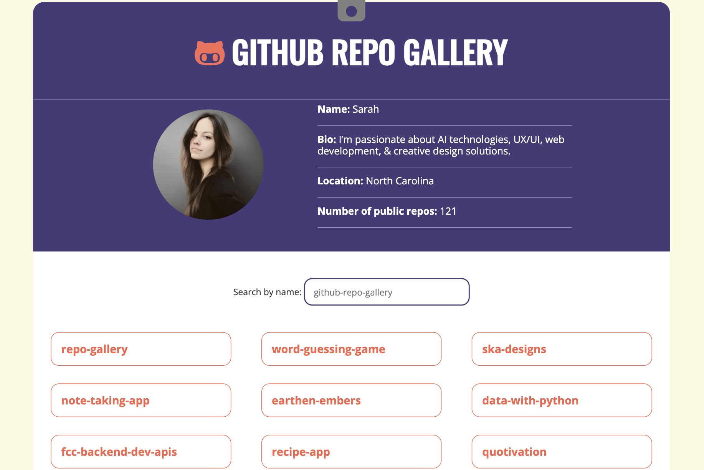

<h1>GitHub Repo Gallery</h1>

This project pulls data from a GitHub portfolio to create a gallery of repos. Users can click on repos to see more details. The repo gallery uses the GitHub API to pull data from the target account to populate details like username, bio, location, and the number of public repositories. The programmed dynamic search functionality allows users to search through repo names. Once they’ve found a repo, they can click on it to see more information and to get a link to the repo on GitHub.

View the GitHub Repo Gallery here: https://labmandala.github.io/gh-repo-gallery/

